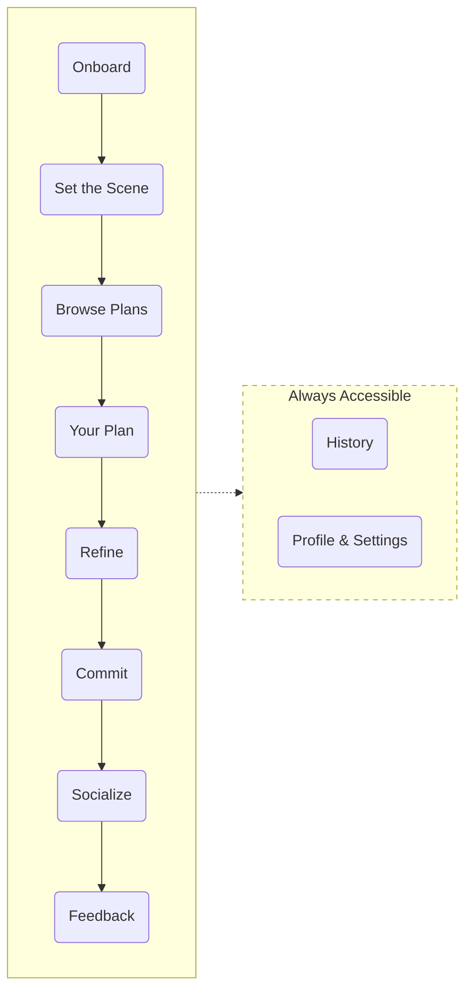

# Tonight — Product Requirements Document

**Created**: March 2026
**Status**: In Progress

---

## 1. Value Proposition

Tonight collapses the full evening planning workflow — event discovery, budgeting, logistics, weather, vibe research, and calendar checks — into a single natural language conversation that returns a fully sequenced, costed, and context-aware evening plan.

**Why this matters now:** LLM orchestration frameworks (LangGraph) and free/cheap API tiers make multi-agent, multi-domain coordination feasible at zero infrastructure cost. The individual APIs have existed for years — what's new is the ability to orchestrate them into a single user-facing interaction.

---

## 2. User Journey

It's 4:00pm on a Thursday. Priya just wrapped work and wants to do something tonight — she's vaguely thinking live music but open to anything. She opens Tonight, types "something fun tonight, under $80, keep it in the Mission," and lets the system handle the rest. In under two minutes she has a fully sequenced evening — dinner, show, drinks, travel, cost, and what to wear — without opening a single other app.

| Phase             | User Intent                                                    | Emotional State                                         | User Action                                                                                                                                |
| ----------------- | -------------------------------------------------------------- | ------------------------------------------------------- | ------------------------------------------------------------------------------------------------------------------------------------------ |
| **Onboard**       | Get set up fast so I can start using this                      | Curious but impatient — don't make me work for it       | Signs up with Google, sets home location, age, dietary restrictions, geographic zone, activity and cuisine preferences                     |
| **Set the Scene** | Tell the app what kind of night I want without overthinking it | Anticipation — the evening is taking shape              | Describes the evening in free text and/or adjusts quick-set fields (date, budget, group, timing, neighborhood, occasion, vibe)             |
| **Browse Plans**  | Quick gut check — did it understand me?                        | Anxious — will this actually be good?                   | Scans 3 plan cards, each showing anchor activity, neighborhood, cost estimate, vibe summary, and photo. Picks one to expand                |
| **Your Plan**     | See the full picture — where, when, how much, what to wear     | Relief — this is actually doable tonight                | Reviews sequenced timeline with all stops, travel, budget breakdown, weather, dress code. Picks from 2-3 dining/drinks options if included |
| **Refine**        | Tweak one thing without blowing up the rest                    | Slightly nervous — will changing this break everything? | Swaps a single piece ("different restaurant," "something cheaper") or goes back to pick a different plan                                   |
| **Commit**        | Lock it in and stop thinking about it                          | Confident — I have a plan, I'm going out                | Saves plan to Google Calendar                                                                                                              |
| **Socialize**     | Let people know where I'll be tonight                          | Excited — sharing makes it real                         | Shares plan as a formatted link via text/DM, posts a visual card to Instagram Stories, or invites friends directly                         |
| **Feedback**      | Tell the app what actually happened so it gets smarter         | Reflective (if went out) or annoyed (if didn't)         | Next day: rates each stop thumbs up/down, flags vibe mismatches, or reports why they didn't go                                             |
| **History**       | Revisit or repeat a past evening                               | Nostalgic or practical                                  | Browses past plans, views details, or re-runs a plan for a new date                                                                        |
| **Settings**      | Update preferences without starting a new session              | Neutral — housekeeping                                  | Updates home location, dietary restrictions, geographic zone, activity/cuisine preferences, quick-set field defaults and modes             |

---

## 3. User Stories

### Phase 1: Onboard

| ID | Story |
|----|-------|
| US-1 | As a new user, I can sign up with Google (for calendar access) and create a display name |
| US-2 | As a new user, I grant location permission and set my home location (and optionally work location) so plans calculate travel from where I actually am |
| US-3 | As a new user, I provide my age and gender so the app can filter age-restricted events (21+ venues/bars) and personalize dress code advice |
| US-4 | As a new user, I set my dietary restrictions so restaurant recommendations never suggest places I can't eat at |
| US-5 | As a new user, I set my geographic comfort zone (SF only / SF + East Bay / full Bay Area) so plans stay within my range |
| US-6 | As a new user, I select what I like doing on a night out (live music, comedy, bars, art, food events, sports, dancing, etc.) so my very first set of plans matches my interests |
| US-7 | As a new user, I select my favorite cuisines so restaurant options are relevant from the start |

### Phase 2: Set the Scene

| ID    | Story                                                                                                                                                                  |
| ----- | ---------------------------------------------------------------------------------------------------------------------------------------------------------------------- |
| US-8 | As a user, I describe what kind of evening I want in natural language (specific or vague) so the system understands my intent even without filling any fields |
| US-9 | As a user, I can select which date I'm planning for (tonight, this Saturday, next Friday, etc.) so the app searches events for the right day |
| US-10 | As a user, I can set a budget ceiling for the evening so the plan stays within what I'm willing to spend |
| US-11 | As a user, I can specify who I'm going with (solo, date, friends, group) so the plan matches the social context — restaurant sizing, vibe, activity type |
| US-12 | As a user, I can set my starting location (home, work, or a custom address) so travel times and costs are calculated from where I'll actually be |
| US-13 | As a user, I can set a start time so the plan sequences around when I'm actually available to head out |
| US-14 | As a user, I can set how late I want to stay out so the plan doesn't suggest events or stops that run past my limit |
| US-15 | As a user, I can set a neighborhood preference for this session ("keep it in the Mission tonight") without changing my global settings |
| US-16 | As a user, I can tag an occasion (birthday, first date, celebrating, casual hangout, etc.) so the plan matches the tone of the evening |
| US-17 | As a user, I can specify indoor or outdoor preference so the plan respects that regardless of weather |
| US-18 | As a user, I can pick a vibe from presets (chill with friends, romantic dinner, big night out, low-key solo, etc.) or type my own |
| US-19 | As a returning user, my quick-set fields are pre-filled from saved defaults so I don't re-enter the same answers every session — but I can still change them for tonight |
| US-20 | As a user, I can hide specific quick-set fields entirely ("don't ask") so they never appear on my input screen — the locked value is always used without me seeing the field |
| US-21 | As a user, I can configure each quick-set field's mode (ask every time / pre-fill default / don't ask) in settings |
| US-22 | As a user, I can connect my Google Calendar so the plan only suggests times when I'm actually free |

### Phase 3: Browse Plans

| ID | Story |
|----|-------|
| US-23 | As a user, I see 3 plan cards — each showing an anchor activity, neighborhood, estimated total cost, a 2-3 line vibe summary, and a photo — so I can quickly compare and pick one |
| US-24 | As a user, when my input is specific ("chill jazz under $80"), the 3 plans are variations on my request (different venues, neighborhoods, price points for the same vibe); when my input is vague ("surprise me"), the 3 plans offer different directions (different event types, moods, neighborhoods) |
| US-25 | As a returning user, the 3 plans are informed by my history — event types I gravitate toward, vibe preferences, budget patterns — without me re-stating preferences each time |
| US-26 | As a returning user, 1 of the 3 plans is always a "discovery" pick — a neighborhood or event type I haven't tried — so the app helps me explore more of SF over time |
| US-27 | As a user, the number of stops in each plan is driven by my available time (start time to how late), not a fixed formula — a 2-hour window might be one activity, a 5-hour window might be dinner + show + drinks |
| US-28 | As a user, I can see where each plan's anchor event was sourced from so I know it's real |
| US-29 | As a user, if none of the 3 plans fit, I can tap "Show me more" to get 3 fresh plans built from the same event pool — without re-entering my input |
| US-30 | As a user, if the plans feel off because my input was wrong, I can tap "Change what I want" to go back to Set the Scene and adjust my request |

### Phase 4: Your Plan

| ID | Story |
|----|-------|
| US-31 | As a user, after picking a plan, I see the full sequenced evening with specific venues, times, and a logical order based on how many stops fit my time window |
| US-32 | As a user, if my plan includes a dining or drinks stop, I see 2-3 restaurant/bar options — each with a photo, vibe description, price range, and distance from the next stop — so I can pick one to lock in |
| US-33 | As a user, I can see the estimated total cost broken down by component (tickets, food, drinks, transportation) |
| US-34 | As a user, I can see weather conditions combined with venue vibe to get a unified "what to wear" recommendation |
| US-35 | As a user, I can see estimated travel time between each stop in my plan |
| US-36 | As a user, I can see vibe and dress code information for venues sourced from reviews and community posts |
| US-37 | As a user, I can see photos of each venue in my plan so I can visually gauge the vibe |
| US-38 | As a user, I can see where each event/venue was sourced from and link out to the original listing for tickets/details |
| US-39 | As a user, I can see my evening plan as a visual timeline with all stops, times, costs, and travel between them |

### Phase 5: Refine

| ID | Story |
|----|-------|
| US-40 | As a user, I can swap any single piece of my plan (e.g., "different restaurant" or "something cheaper") and only that part regenerates while the rest stays intact |
| US-41 | As a user, I can go back to the 3 plan cards and pick a different one without re-running event discovery |

### Phase 6: Commit

| ID | Story |
|----|-------|
| US-42 | As a user, I can save my plan to Google Calendar as a series of events — one per stop with venue address, cost notes, and departure reminders |
| US-43 | As a user, my committed plan is saved to history so I can revisit it later |

### Phase 7: Socialize

| ID | Story |
|----|-------|
| US-44 | As a user, I can share my committed plan as a formatted link via text, iMessage, WhatsApp, or DM so friends know where I'll be tonight |
| US-45 | As a user, I can share a visual plan card (image) to Instagram Stories or other social platforms so I can post my evening plans |
| US-46 | As a user, I can invite friends directly to my plan — they receive a link showing the full itinerary with venues, times, and a map |

### Phase 8: Feedback

| ID | Story |
|----|-------|
| US-47 | As a user who went out, I get a next-day prompt to rate each stop (thumbs up/down) with optional free text, so the app learns what I actually enjoyed |
| US-48 | As a user who went out, I can flag "vibe didn't match" on any stop if the description, photos, or dress code advice was misleading — so the system learns which sources are reliable for which venues |
| US-49 | As a user who didn't end up going, I get a softer prompt asking what happened (plans changed, too expensive, too far, etc.) so the app adjusts my preferences accordingly |

### History (always accessible)

| ID | Story |
|----|-------|
| US-50 | As a user, I can browse all my past committed plans — see where I went, when, what it cost, and how I rated each stop |
| US-51 | As a user, I can re-run a past plan for a new date — same vibe and preferences but with updated event availability |

### Settings (always accessible)

| ID | Story |
|----|-------|
| US-52 | As a user, I can update my home location, dietary restrictions, geographic comfort zone, activity/cuisine preferences, and all quick-set defaults in settings at any time |

---

## 4. System Overview

*TBD*

---

## 5. Data Sources & APIs

*TBD*

---

## 6. Risks

| Risk                                                     | Impact                                                         |
| -------------------------------------------------------- | -------------------------------------------------------------- |
| Scraper fragility  (Lu.ma, 19hz, Do The Bay)          | You may not be able to find the right events and may miss many |
| Cost estimation inaccuracy                               | incorrect restaurant / bar / ride cost estimations             |
| Vibe/dress code data is sparse or wrong                  | Unable to provide 'what to dress' information                  |
| Free API tier rate limits (especially Serper at 2500/mo) | Limited scalability                                            |
| LLM hallucination in plan narration                      | incorrect results and unintended consequences                  |
| Google Calendar OAuth complexity                         | Heavy lift for an MVP                                          |
| SF weekday event activity may be too thin                | plans could feel empty or repetitive on slower nights          |
| slow API + LLM calls                                     | result generation may take too long                            |
