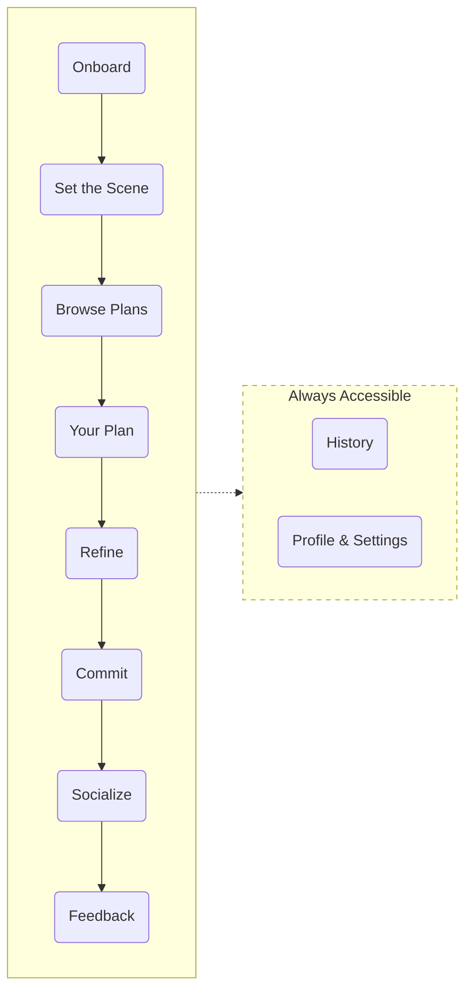

# Tonight — Product Requirements Document

**Created**: March 2026
**Status**: In Progress

---

## Value Proposition

Tonight collapses the full evening planning workflow — event discovery, budgeting, logistics, weather, vibe research, and calendar checks — into a single natural language conversation that returns a fully sequenced, costed, and context-aware evening plan.

**Why this matters now:** LLM orchestration frameworks (LangGraph) and free/cheap API tiers make multi-agent, multi-domain coordination feasible at zero infrastructure cost. The individual APIs have existed for years — what's new is the ability to orchestrate them into a single user-facing interaction.

---

## User Journey

It's 4:00pm on a Thursday. Priya just wrapped work and wants to do something tonight — she's vaguely thinking live music but open to anything. She opens Tonight, types "something fun tonight, under $80, keep it in the Mission," and lets the system handle the rest. In under two minutes she has a fully sequenced evening — dinner, show, drinks, travel, cost, and what to wear — without opening a single other app.

| Phase             | User Intent                                                    | Emotional State                                         | User Action                                                                                                                                |
| ----------------- | -------------------------------------------------------------- | ------------------------------------------------------- | ------------------------------------------------------------------------------------------------------------------------------------------ |
| **Onboard**       | Get set up fast so I can start using this                      | Curious but impatient — don't make me work for it       | Signs up with Google, sets home location, age, dietary restrictions, geographic zone, activity and cuisine preferences                     |
| **Set the Scene** | Tell the app what kind of night I want without overthinking it | Anticipation — the evening is taking shape              | Describes the evening in free text and/or adjusts quick-set fields (date, budget, group, timing, neighborhood, occasion, vibe)             |
| **Browse Plans**  | Quick gut check — did it understand me?                        | Anxious — will this actually be good?                   | Scans 3 plan cards, each showing anchor activity, neighborhood, cost estimate, vibe summary, and photo. Picks one to expand                |
| **Your Plan**     | See the full picture — where, when, how much, what to wear     | Relief — this is actually doable tonight                | Reviews sequenced timeline with all stops, travel, budget breakdown, weather, dress code. Picks from 2-3 dining/drinks options if included |
| **Refine**        | Tweak one thing without blowing up the rest                    | Slightly nervous — will changing this break everything? | Swaps a single piece ("different restaurant," "something cheaper") or goes back to pick a different plan                                   |
| **Commit**        | Lock it in and stop thinking about it                          | Confident — I have a plan, I'm going out                | Saves plan to Google Calendar                                                                                                              |
| **Socialize**     | Let people know where I'll be tonight                          | Excited — sharing makes it real                         | Shares plan as a formatted link via text/DM, posts a visual card to Instagram Stories, or invites friends directly                         |
| **Feedback**      | Tell the app what actually happened so it gets smarter         | Reflective (if went out) or annoyed (if didn't)         | Next day: rates each stop thumbs up/down, flags vibe mismatches, or reports why they didn't go                                             |
| **History**       | Revisit or repeat a past evening                               | Nostalgic or practical                                  | Browses past plans, views details, or re-runs a plan for a new date                                                                        |
| **Settings**      | Update preferences without starting a new session              | Neutral — housekeeping                                  | Updates home location, dietary restrictions, geographic zone, activity/cuisine preferences, quick-set field defaults and modes             |

---

## Phase 1: Onboard

### User Stories

| ID   | Story                                                                                                   |
| ---- | ------------------------------------------------------------------------------------------------------- |
| US-1 | As a new user, I can sign up and create a display name so I have an account                             |
| US-2 | As a new user, I grant location permission so the app can detect where I am when generating plans       |
| US-3a | As a new user, I provide my age so the app can filter age-restricted events                             |
| US-3b | As a new user, I provide my gender so the app can personalize recommendations                           |
| US-4 | As a new user, I set my dietary restrictions so restaurant recommendations are safe for me              |
| US-5 | As a new user, I set my geographic comfort zone so plans stay within my travel range                    |
| US-6 | As a new user, I select my activity preferences so my first plans match my interests                    |
| US-7 | As a new user, I select my cuisine preferences so restaurant options are relevant from the start        |

### Acceptance Criteria

**US-1 — Google sign-up**
- Sign up via Google OAuth only — no email/password flow
- Google grants calendar read access at sign-up (used later in US-22)
- User sets a display name before proceeding; no character limit enforced but truncated at 20 chars in UI
- If the user already has an account, sign-in flow instead of sign-up

**US-2 — Location setup**
- App requests browser/device location permission

**US-3a — Age**
- Birthdate picker, not a free-text number — needed for precise 21+ filtering
- Required to proceed

**US-3b — Gender**
- Options: Man, Woman, Non-binary, Prefer not to say
- Used for dress code personalization and event filtering, if applicable 
- Required to proceed

**US-4 — Dietary restrictions**
- Multi-select from a predefined list (vegetarian, vegan, gluten-free, halal, kosher, nut allergy, shellfish allergy, dairy-free)
- User can select multiple restrictions
- "None" is an explicit option and cannot be selected with another option
- Editable later in Settings

**US-5 — Geographic comfort zone**
- Three options: SF only / SF + East Bay / full Bay Area
- Default selection is SF only
- Editable later in Settings

**US-6 — Activity preferences**
- Multi-select from: live music, comedy, bars, art, food events, sports, dancing, theater, outdoor activities, nightlife
- "Will select later" is an option — allows the user to skip without choosing any and come back in Settings
- [ ] No maximum — user can select all
- Editable later in Settings

**US-7 — Cuisine preferences**
- Multi-select from a predefined list (Italian, Japanese, Mexican, Chinese, Indian, Thai, Korean, Mediterranean, American, Ethiopian, Vietnamese, French, etc.)
- "Will select later" is an option — allows the user to skip without choosing any and come back in Settings
- User can select multiple restrictions
- Editable later in Settings

## Phase 2: Set the Scene

### User Stories

| ID    | Story                                                                                                         |
| ----- | ------------------------------------------------------------------------------------------------------------- |
| US-8  | As a user, I describe what kind of evening I want in natural language so the system understands my intent     |
| US-9  | As a user, I can select which date I'm planning for so the app searches events for the right day              |
| US-10 | As a user, I can set a budget ceiling so the plan stays within what I'm willing to spend                      |
| US-11 | As a user, I can set my group type so the plan matches the social context                                     |
| US-12 | As a user, I can set my starting location so travel times and costs are accurate                              |
| US-13 | As a user, I can set when I want to head out so the plan starts at the right time                             |
| US-14 | As a user, I can set how late I want to stay out so the plan respects my limit                                |
| US-15 | As a user, I can set a neighborhood preference for this session without changing my global settings           |
| US-16 | As a user, I can tag an occasion so the plan matches the tone of the evening                                  |
| US-17 | As a user, I can specify indoor or outdoor preference so the plan respects that                               |
| US-18 | As a user, I can select a vibe so the plan matches my mood                                                    |
| US-19 | As a returning user, my quick-set fields are pre-filled from saved defaults so I don't re-enter every session |
| US-20 | As a user, I can hide specific quick-set fields so they never appear and always use my saved value            |
| US-21 | As a user, I can configure each quick-set field's behavior in settings                                        |
| US-22 | As a user, I can connect my Google Calendar so the plan only suggests times when I'm free                     |

### Acceptance Criteria

**US-8 — Natural language input**
- Free-text field is the primary and most prominent input on the screen
- System extracts intent even from vague input ("something fun", "surprise me")
- If the user fills only the text field and hits submit, the system generates plans using text + saved defaults — no other field is required
- Text input has no character limit

**US-9 — Date selection**
- Defaults to "Tonight"
- Options: Tonight, Tomorrow, or a specific date via date picker
- Date picker does not allow past dates
- Max 14 days out — beyond that, event inventory is unreliable

**US-10 — Budget ceiling**
- Preset options: $50, $80, $120, $200, No limit
- User can also type a custom number
- Budget applies to the total evening, not per-stop
- "$500" is the default if unset

**US-11 — Group type**
- Options: Solo, Date (2 people), Friends (3-6), Group (7+)
- Affects restaurant sizing, activity suitability, and vibe
- Default: Solo

**US-12 — Starting location**
- Quick-select: Home, Work (if set in onboarding), any saved address (from US-53), select current location ,or Custom
- Custom opens an address search field
- Default: Home

**US-13 — Head-out time**
- This is a preference (when you *want* to start), not availability — calendar (US-22) handles availability
- Time picker in 30-minute increments
- Default: 6:00pm if current time is before 6pm, otherwise 1 hour from now (rounded to nearest :00 or :30)
- Cannot be set in the past
- If calendar is connected and the chosen time conflicts with an event, system warns with the blocker details

**US-14 — End time / how late**
- Options: 10pm, 11pm, Midnight, 1am, 2am, No limit
- Default: Midnight
- Must be after start time

**US-15 — Neighborhood preference**
- Multi-select from SF neighborhoods (Mission, Marina, Castro, Hayes Valley, North Beach, SoMa, etc.)
- Selecting none means "anywhere within my geographic zone"
- Overrides the global geographic zone (US-5) for this session only — does not change the saved setting

**US-16 — Occasion tag**
- Single-select from: Birthday, First date, Anniversary, Celebrating, Casual hangout, Work outing, No occasion
- Default: No occasion
- Occasion influences vibe and venue formality, not event type

**US-17 — Indoor/outdoor**
- Options: Indoor, Outdoor, No preference
- Default: No preference
- If Outdoor is selected and weather is bad, system warns but does not override the preference

**US-18 — Vibe**
- Preset options only: Chill with friends, Romantic dinner, Big night out, Low-key solo, Adventure, Cultural
- Single-select — one vibe per session
- No free text input — presets keep the system's vibe-to-plan mapping predictable

**US-19 — Smart defaults**
- All quick-set fields pre-fill from the user's saved defaults
- Pre-filled values are visually distinct (e.g., lighter text) so the user knows they're defaults, not fresh input
- User can override any field for this session without changing the saved default

**US-20 — Hidden fields**
- Hidden fields do not render on the Set the Scene screen at all
- The locked value is always sent with the request
- A small "N fields hidden" indicator lets the user know fields are hidden, with a link to Settings to change it

**US-21 — Field mode configuration**
- Per-field toggle in Settings with 3 modes: Ask every time (no default) / Pre-fill default (show field with saved value) / Don't ask (hide field, always use saved value)
- Default mode for all fields: Ask every time
- Changing mode takes effect on the next session, not retroactively

**US-22 — Google Calendar integration**
- Uses the Google OAuth granted at sign-up (US-1) — no second auth flow
- Reads calendar events for the selected date to identify busy blocks
- Plan only schedules stops during free blocks
- If a conflict exists, system shows what's blocking: event name, time range (e.g., "Dinner with Alex, 7-8:30pm is blocking this slot")
- If no free time exists, system shows a message: "Your calendar is full — want to plan anyway?"
- User can disconnect calendar access in Settings

### Phase 3: Browse Plans

| ID    | Story                                                                                    |
| ----- | ---------------------------------------------------------------------------------------- |
| US-23 | As a user, I see plan cards so I can quickly compare options and pick one                |
| US-24 | As a user, the plans vary based on how specific or vague my input was                    |
| US-25 | As a returning user, plans are informed by my history so I don't re-state preferences    |
| US-26 | As a returning user, one plan is always a discovery pick so the app helps me explore     |
| US-27 | As a user, the number of stops in each plan is driven by my available time               |
| US-28 | As a user, I can see where each plan's anchor event was sourced from so I know it's real |
| US-29 | As a user, I can request more plans without re-entering my input                         |
| US-30 | As a user, I can go back to adjust my request                                            |

#### Acceptance Criteria

**US-23 — Plan cards**
- Exactly 3 cards, never 2 or 4
- Each card shows: anchor activity name, neighborhood, estimated total cost, 2-3 line vibe summary, 3-4 photos
- Photos are of the anchor venue/activity, not a generic stock image
- Cost shows as a single number ("~$75"), not a breakdown
- Cards are ranked: best match first, discovery pick last
- Tapping a card takes you to the full plan (Phase 4), not an expand-in-place

**US-24 — Specific vs vague input**
- If the user's input names a specific activity type, genre, or venue — all 3 plans share that category but vary on venue, neighborhood, or price
- If the input is open-ended ("surprise me", "something fun") — the 3 plans differ on activity type, not just venue
- No two cards should share the same anchor venue

**US-25 — History-informed plans**
- Plans weight toward activity types the user has rated thumbs-up in the past
- Plans weight away from venues the user has rated thumbs-down
- First-time users get purely input-driven plans, no history signal

**US-26 — Discovery pick**
- The 3rd card is always the discovery pick
- "Discovery" means a neighborhood OR activity type the user has never committed to a plan before
- If the user has tried everything in inventory, discovery falls back to least-recently-visited
- Discovery pick is visually labeled (small tag like "Something new") so the user knows why it feels different

**US-27 — Time-driven stop count**
- Available time = end time minus start time minus total travel time
- Each stop gets a minimum of 45 minutes (no rushed 20-minute stops)
- 1-2 hours available → 1 stop
- 2-4 hours → 2 stops
- 4+ hours → 3 stops max
- These are defaults, not hard rules — an anchor event with a fixed duration (e.g., a 90-min show) overrides the formula

**US-28 — Sourcing**
- Each card shows a small source label under the anchor activity (e.g., "via Eventbrite", "via 19hz")
- Source links to the original listing
- If the event was found via scraping, source shows the site name, not "scraped from"

**US-29 — Show me more**
- Button sits below the 3 cards
- Generates 3 entirely new plans — no overlap with the previous set's anchor venues
- Uses the same event pool (no new API calls unless the pool is exhausted)
- User can hit it multiple times; if the event pool runs dry, show a message: "That's everything for tonight — try changing your input"

**US-30 — Change inputs**
- Labeled "Change inputs" button, not a generic back arrow
- Returns to Set the Scene with all fields preserved exactly as the user left them
- Shows a confirmation dialog ("Your plans will be lost — go back?") since generated plans will be discarded

### Phase 4: Your Plan

| ID    | Story                                                                                         |
| ----- | --------------------------------------------------------------------------------------------- |
| US-31 | As a user, I see the full sequenced evening with specific venues, times, and logical order    |
| US-32 | As a user, I can choose from multiple restaurant/bar options for dining and drinks stops      |
| US-33 | As a user, I can see the estimated total cost broken down by component                        |
| US-34 | As a user, I get a "what to wear" recommendation based on weather and venue vibe              |
| US-35 | As a user, I can see estimated travel time between each stop                                  |
| US-36 | As a user, I can see vibe and dress code information for each venue                           |
| US-37 | As a user, I can see photos of each venue so I can visually gauge the vibe                    |
| US-38 | As a user, I can see where each event/venue was sourced from and link to the original listing |
| US-39 | As a user, I can see my evening plan as a visual timeline                                     |
| US-39a | As a user, I can see an embedded map for each venue so I understand where it is              |

#### Acceptance Criteria

**US-31 — Full sequenced evening**
- Shows all stops in chronological order with venue name, address, time slot, and expected duration
- Stop count matches the time-driven logic from US-27
- Each stop has a clear start time and end time
- Transition between stops shows travel method and time

**US-32 — Restaurant/bar options**
- 5 options per dining/drinks stop
- Each option shows: name, rating, review count, distance from previous stop, closing time, photo
- Options ranked by rating weighted by review volume
- Only shows restaurants open during the planned stop time
- Only shows restaurants that match the user's dietary restrictions (US-4)
- Tapping an option locks it into the plan

**US-33 — Cost breakdown**
- Total cost at the top, broken down below by: tickets, food, drinks, transportation
- Each line item shows an estimated range, not a false-precision number
- Transportation cost based on selected transit mode or default (Uber estimate)
- Food/drinks estimates based on venue price tier and group size

**US-34 — What to wear**
- Single unified recommendation combining weather forecast and venue dress code
- Shows current weather conditions (temp, rain probability) as supporting context
- Recommendation is gender-aware based on US-3b
- Updates if the user swaps a venue in Refine (Phase 5)

**US-35 — Travel time between stops**
- Shown between each stop in the timeline
- Displays estimated minutes and travel method
- If walking is under 15 minutes, default to walking; otherwise show ride estimate
- Travel time factors into the overall plan sequencing — stops aren't scheduled back-to-back without transit time

**US-36 — Vibe and dress code**
- Each venue shows a short vibe description sourced from reviews and community posts
- Dress code shown as a tag (casual, smart casual, upscale, etc.)
- If data is sparse, show "No dress code info available" rather than guessing

**US-37 — Venue photos**
- Each venue shows 3-5 photos sourced from Google Places or venue listings
- Photos are of the actual venue interior/exterior, not food-only shots
- Photos are swipeable/scrollable

**US-38 — Source attribution**
- Each venue/event shows source name and a link to the original listing
- Link opens in a new tab/browser, not in-app
- For ticketed events, the link goes directly to the ticket purchase page when possible

**US-39 — Visual timeline**
- Plan displayed as a vertical timeline with stops, travel segments, and time markers
- Each node shows venue name, time, and cost
- Travel segments show duration and method between nodes
- Timeline is the primary view of the plan, not a secondary tab

**US-39a — Embedded map**
- Each venue card includes an embedded Google Maps view showing the venue location
- Map shows the venue pin and the user's starting location or previous stop for spatial context
- Uses Google Maps Embed API
- Map is view-only, not interactive (no routing or directions in-app)

### Phase 5: Refine

| ID | Story |
|----|-------|
| US-40 | As a user, I can swap any single piece of my plan and only that part regenerates                               |
| US-41 | As a user, I can go back to the plan cards and pick a different one without re-running discovery               |

#### Acceptance Criteria

**US-40 — Swap a single piece**
- Each stop in the plan has a "Swap" action
- Swapping a stop regenerates only that stop — all other stops, times, and travel remain intact
- User can specify what they want different ("cheaper", "closer", "different cuisine") or just request an alternative
- Swapped stop respects the same time slot and travel constraints as the original
- If no viable alternatives exist, system says so rather than forcing a bad option

**US-41 — Back to plan cards**
- "See other plans" button available from the plan detail view
- Returns to the 3 plan cards from Phase 3 with all cards still available
- Previously viewed plan is marked so the user knows which one they already explored
- No new API calls — uses the same generated plans

### Phase 6: Commit

| ID | Story |
|----|-------|
| US-42 | As a user, I can save my plan to Google Calendar so it's on my schedule                                        |
| US-43 | As a user, my committed plan is saved to history so I can revisit it later                                     |

#### Acceptance Criteria

**US-42 — Save to Google Calendar**
- Creates one calendar event per stop with: venue name as title, address in location field, cost and notes in description, departure reminder before each stop
- Uses the Google OAuth granted at sign-up (US-1)
- Shows a success confirmation with a link to view in Google Calendar
- If calendar write fails, shows error and lets user retry

**US-43 — Save to history**
- Plan is automatically saved to history when committed — no extra action needed
- Saved plan includes: all stops, venues, times, costs, weather, what-to-wear recommendation, and the original input
- Plan is saved even if the Google Calendar sync fails

### Phase 7: Socialize

| ID | Story |
|----|-------|
| US-44 | As a user, I can share my plan as a formatted link so friends know where I'll be                               |
| US-45 | As a user, I can share a visual plan card to social platforms so I can post my evening plans                    |
| US-46 | As a user, I can invite friends directly to my plan so they can see the full itinerary                         |

#### Acceptance Criteria

**US-44 — Share as link**
- Generates a shareable URL that opens a read-only view of the plan
- Link shows: all stops, venues, times, and embedded map — no login required to view
- Share action triggers the native OS share sheet (text, iMessage, WhatsApp, etc.)
- Link does not expire

**US-45 — Visual plan card for social**
- Generates a styled image (card) summarizing the plan: evening title, stops, neighborhoods, vibe
- Image is sized for Instagram Stories (9:16) and general sharing (1:1)
- User can save the image to camera roll or share directly via share sheet
- No personal data (budget, cost breakdown) on the shareable image

**US-46 — Invite friends**
- User can invite via link or directly by entering a phone number / email
- Invitees receive a link showing the full itinerary with venues, times, and embedded map
- Invitees do not need a Tonight account to view the plan
- Invited friends are listed on the plan so the user can see who was invited

### Phase 8: Feedback

| ID | Story |
|----|-------|
| US-47 | As a user who went out, I get a next-day prompt to rate each stop so the app learns what I enjoyed              |
| US-48 | As a user who went out, I can flag vibe mismatches so the system improves its recommendations                   |
| US-49 | As a user who didn't go out, I get a prompt asking what happened so the app adjusts accordingly                 |

#### Acceptance Criteria

**US-47 — Rate each stop**
- Next-day push notification prompts the user to rate their evening
- Each stop gets a thumbs up / thumbs down rating
- Optional free-text field per stop for additional notes
- Ratings feed into the history-informed plan ranking (US-25)
- User can skip rating entirely — it's never required

**US-48 — Flag vibe mismatch**
- Per-stop option: "Vibe didn't match"
- When flagged, user selects what was off: description, photos, dress code, crowd, noise level
- Flags are tracked per venue and per source — used to improve source reliability scoring over time
- Flagging is separate from the thumbs up/down rating — a user can enjoy a venue but still flag a misleading description

**US-49 — Didn't go out prompt**
- Softer notification tone/copy than the went-out prompt
- Options: Plans changed, Too expensive, Too far, Weather, Didn't feel like it, Other
- Single-select, not multi-select — captures the primary reason
- Response adjusts future plan weighting (e.g., repeated "too expensive" lowers default budget suggestions)
- User can dismiss without answering

### History (always accessible)

| ID | Story |
|----|-------|
| US-50 | As a user, I can browse all my past committed plans and their details                                          |
| US-51 | As a user, I can re-run a past plan for a new date with updated event availability                             |

#### Acceptance Criteria

**US-50 — Browse past plans**
- Plans listed in reverse chronological order
- Each entry shows: date, anchor activity, neighborhood, total cost, and overall rating (if rated)
- Tapping a plan opens the full detail view with all stops, venues, times, costs, and ratings
- Plans that were committed but not rated show a "Rate this evening" prompt

**US-51 — Re-run a past plan**
- "Do this again" button on any past plan
- Opens Set the Scene pre-filled with the original input and preferences
- Generates new plans using the same vibe/intent but with current event availability
- Does not guarantee the same venues — events may no longer be available

### Settings (always accessible)

| ID | Story |
|----|-------|
| US-52 | As a user, I can update all my profile and preference settings at any time                                     |
| US-53 | As a user, I can save named addresses so I can quickly select them as starting locations                       |

#### Acceptance Criteria

**US-52 — Settings management**
- All onboarding fields (location, age, gender, dietary, geographic zone, activities, cuisines) are editable
- All quick-set field defaults and modes (US-21) are configurable here

**US-53 — Saved addresses**
- User can save named addresses with a label (e.g., "Mom's house", "Gym") and an address via search or pin-on-map
- No limit on number of saved addresses
- Saved addresses appear as quick-select options in US-12 (starting location)
- User can edit or delete saved addresses at any time

---

## 4. System Overview

*TBD*

---

## 5. Data Sources & APIs

*TBD*

---

## 6. Risks

| Risk                                                     | Impact                                                         |
| -------------------------------------------------------- | -------------------------------------------------------------- |
| Scraper fragility  (Lu.ma, 19hz, Do The Bay)          | You may not be able to find the right events and may miss many |
| Cost estimation inaccuracy                               | incorrect restaurant / bar / ride cost estimations             |
| Vibe/dress code data is sparse or wrong                  | Unable to provide 'what to dress' information                  |
| Free API tier rate limits (especially Serper at 2500/mo) | Limited scalability                                            |
| LLM hallucination in plan narration                      | incorrect results and unintended consequences                  |
| Google Calendar OAuth complexity                         | Heavy lift for an MVP                                          |
| SF weekday event activity may be too thin                | plans could feel empty or repetitive on slower nights          |
| slow API + LLM calls                                     | result generation may take too long                            |
